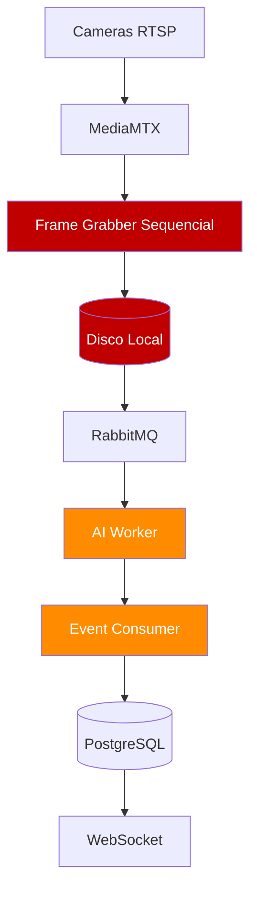
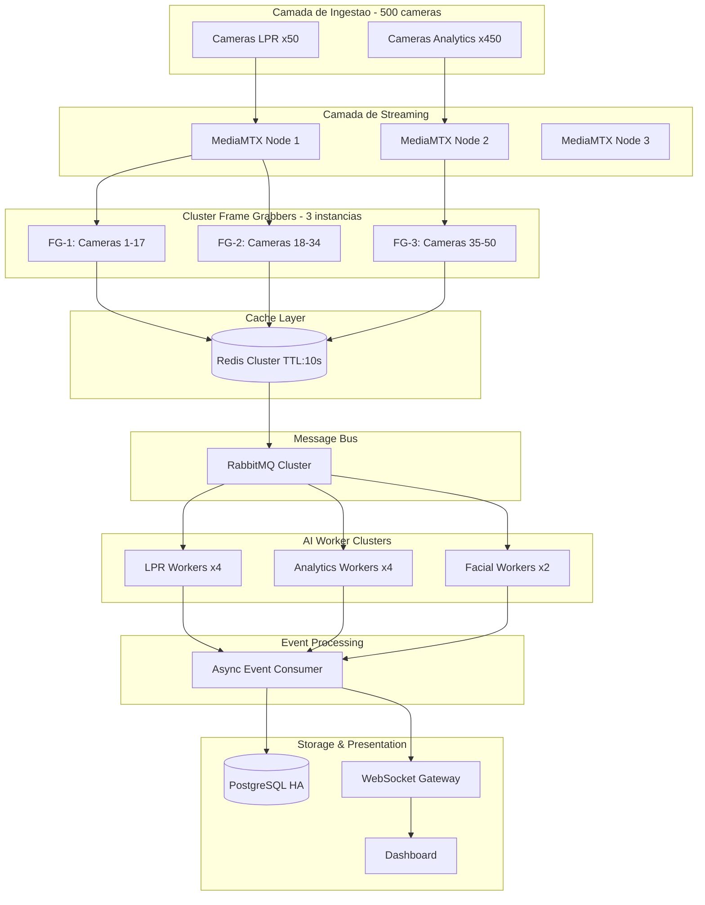

# VMS White Label — Guia do Projeto

## Objetivos Estratégicos

- Suportar 500 câmeras simultâneas em operação ininterrupta (24/7)
- Processar LPR para 50 câmeras com até 6 veículos simultâneos por câmera
- Garantir latência de detecção inferior a 2 segundos end-to-end
- Arquitetura horizontalmente escalável para crescimento futuro
- Alta disponibilidade com tolerância a falhas em todos os componentes críticos

## Resumo de Capacidades

| Métrica | Valor | Status |
|---------|-------|--------|
| Total de câmeras suportadas | 500 câmeras | Meta |
| Câmeras LPR | 50 câmeras (10%) | Meta |
| Câmeras Analytics Gerais | 450 câmeras (90%) | Meta |
| Veículos simultâneos por câmera LPR | Até 6 veículos | Meta |
| Latência máxima de detecção | < 2 segundos | Requisito crítico |
| Disponibilidade do sistema | 24/7 (99,9%+) | Requisito crítico |
| GPUs requeridas | 4 GPUs | Infraestrutura |
| Latência estimada end-to-end | ~217ms | Projetado |

## Arquitetura Atual



### Problemas Críticos Identificados

**Problema 1: Frame Grabber Sequencial**

| Métrica | Atual | Necessário | Gap |
|---------|-------|------------|-----|
| Tempo por câmera | 55ms (cv2 sequencial) | < 1ms (paralelo) | 55x mais lento |
| Ciclo para 50 câmeras | ~2750ms | < 100ms | Inviável |
| FPS efetivo | 0.36 FPS | 50 FPS | -99.28% |

**Problema 2: Concorrência Limitada nos Workers de IA**
- `MAX_CONCURRENT_FRAMES=4` → Capacidade: ~7.5 FPS | Demanda: 50 FPS | Deficit: -85%

**Problema 3: OCR Lento com Tesseract**

| Cenário | Latência OCR | Impacto Total |
|---------|-------------|---------------|
| 1 placa por frame | ~80ms | 80ms adicionais |
| 3 placas por frame | ~240ms | 240ms adicionais |
| 6 placas por frame (max) | ~480ms | 480ms adicionais |

**Problema 4: I/O de Disco para Frames**
- Escrita JPEG no disco: 15-30ms por frame
- Leitura sequencial: 10-20ms por frame
- Contenção de I/O com múltiplas câmeras simultâneas
- Acúmulo de arquivos temporários sem cleanup adequado

**Problema 5: Event Consumer Bloqueante**

| Métrica | Atual | Requerido |
|---------|-------|-----------|
| Capacidade do consumer | ~66 eventos/s | ~300 eventos/s |
| Modelo de processamento | Sequencial bloqueante | Async concorrente |
| Inserções no banco | Uma por vez | Batch inserts |

## Arquitetura Proposta

### Visão Geral



### Princípios Arquiteturais

1. **Separação de Concerns** — Cada componente com responsabilidade única, desacoplado por filas de mensagens
2. **Zero I/O de Disco no Pipeline de IA** — Redis Frame Cache (TTL 10s, compressão JPEG) substitui disco
3. **Workers Especializados por Domínio** — Clusters independentes para analytics gerais, LPR e facial
4. **Backpressure e Flow Control** — RabbitMQ como buffer, prefetch configurável por worker
5. **Escalabilidade Horizontal** — Componentes stateless, escala por adição de instâncias

## Estrutura

```
├── backend-django/          # Django REST API (tenants, cameras, ROIs, detections, auth)
├── backend-fastapi/         # Workers Python assíncronos
│   └── workers/
│       ├── ai_worker/       # Pipeline de IA (YOLO + ByteTrack + analyzers)
│       ├── frame_grabber/   # Captura frames dos streams (1 FPS)
│       ├── recorder/        # Gravação FFmpeg segmentada
│       ├── clip_builder/    # Composição de clips de vídeo
│       └── purge/           # Limpeza de storage
├── frontend/                # SPA + Nginx reverse proxy
├── infra/                   # docker-compose.yml, nginx.conf, mediamtx.yml
├── models/                  # Modelos IA (plate_detector.pt)
└── storage/                 # frames, recordings, snapshots, heatmaps
```

## Pipeline de IA

```
Camera (RTSP) → MediaMTX → Frame Grabber (1 FPS)
  → RabbitMQ [ai.frame]
  → AI Worker (YOLO + ByteTrack + analyzers por ROI)
  → RabbitMQ [ai.events]
  → Django consume_ai_events → PostgreSQL + WebSocket → Frontend
```

### Arquivos-chave do AI Worker

| Arquivo | Função |
|---------|--------|
| `workers/ai_worker/worker/service.py` | Orquestrador principal (~630 linhas) |
| `workers/ai_worker/worker/analyzers/lpr.py` | LPR: YOLO plate_detector + EasyOCR |
| `workers/ai_worker/worker/analyzers/facial.py` | Facial: insightface buffalo_l (CPU) |
| `workers/ai_worker/worker/analyzers/general.py` | Legacy — lógica migrada para service.py |
| `workers/ai_worker/worker/analyzers/tracking.py` | Legacy — lógica migrada para service.py |
| `workers/ai_worker/worker/analyzers/heatmap.py` | Legacy — lógica migrada para service.py |
| `workers/ai_worker/Dockerfile.ai` | Multi-stage build (pytorch CUDA 12.1) |

### Analíticos Suportados (ia_type nas ROIs)

Ordenados por prioridade:

1. **`lpr`** — Leitura de placas (YOLO custom + EasyOCR). Modelo: `/app/models/plate_detector.pt`
2. **`object_detection`** — Detecta classes COCO configuradas dentro de uma zona poligonal
3. **`intrusion`** — Detecta qualquer objeto em zona proibida
4. **`crowd`** — Conta pessoas na zona, alerta se > threshold
5. **`vehicle_traffic`** — Conta veículos cruzando uma linha (sv.LineZone)
6. **`human_traffic`** — Conta pessoas cruzando uma linha
7. **`line_crossing`** — Cruzamento bidirecional de linha (qualquer classe)
8. **`loitering`** — Pessoa na zona por mais de X segundos
9. **`abandoned_object`** — Objeto sem dono por mais de X segundos
10. **`queue`** — Profundidade de fila + tempo médio de espera
11. **`heatmap`** — Mapa de calor por acumulação de centroids (Redis + Gaussian blur)
12. **`facial`** — Reconhecimento facial (insightface buffalo_l, cosine similarity)

### GPU / CUDA

- **Base image**: `pytorch/pytorch:2.3.0-cuda12.1-cudnn8-runtime` (multi-stage no Dockerfile.ai)
- **DEVICE**: definido em `service.py:34` → `'cuda' if torch.cuda.is_available() else 'cpu'`
- **AI_DEVICE**: env var lida pelos analyzers legacy (general, tracking, lpr, heatmap)
- **docker-compose**: `deploy.resources.reservations.devices` com driver nvidia
- Não depende mais de `ai-base:latest` local — tudo no Dockerfile.ai

### Modelos

| Modelo | Tamanho | Origem | Uso |
|--------|---------|--------|-----|
| yolov8n.pt | 6.2MB | Download automático (ultralytics) | Detecção geral COCO |
| plate_detector.pt | 52MB | `/models/` (versionado) | Detecção de placas |
| buffalo_l | ~280MB | Download automático (insightface) | Reconhecimento facial |

### Mensageria (RabbitMQ)

| Queue/Exchange | Producer | Consumer |
|---------------|----------|----------|
| `roi.updated` | Django (signal) | Frame Grabber |
| `ai.frame` | Frame Grabber | AI Worker |
| `ai.events` | AI Worker | Django (consume_ai_events) |
| `persons.updated` | Django (signal) | AI Worker (reload embeddings) |

### Deduplicação (Redis)

- `dedup:lpr:{camera_id}:{plate}` → 30s TTL
- `dedup:object:{camera_id}:{roi_id}:{class}` → 30s TTL
- `dedup:crowd:{camera_id}:{roi_id}` → 60s TTL
- `dedup:facial:{camera_id}:{roi_id}:{person_id}` → 60s TTL

### Docker

- **Build AI worker**: `cd infra && docker-compose build ai-worker`
- **Logs AI worker**: `docker-compose logs -f ai-worker`
- **Volumes persistentes**: `ai-model-cache` (YOLO), `ai-insightface-cache` (buffalo_l)
- O FacialAnalyzer carrega em thread daemon — não bloqueia o worker

### Acesso

- **Frontend**: `http://172.18.0.12` (container frontend, porta 80)
- **Admin**: `admin@gtvision.com` / `Admin123!`
- **RabbitMQ UI**: `http://localhost:15672` (guest/guest)

## Documentação Técnica Completa

Ver `docs/architecture-v2.md` para especificação completa incluindo:
- Seções 4-5: Especificação de componentes (MediaMTX, Frame Grabber, Redis, RabbitMQ, AI Workers) e pipelines
- Seção 6: Infraestrutura (hardware, rede, storage — 4 GPUs RTX 4090, NAS 400TB)
- Seção 7: Monitoramento (Prometheus + Grafana + Loki + Tempo, SLOs)
- Seção 8: Sprints (5 sprints x 2 semanas = 10 semanas)
- Seções 9-12: Riscos, deployment, microserviços, performance (172ms LPR end-to-end)

## Problemas Conhecidos

- [ ] **Gravação**: recorder-worker aparentemente não está gravando — investigar
- [x] **GPU**: Corrigido — Dockerfile.ai agora usa multi-stage com pytorch CUDA direto
- [x] **ai-base**: Eliminada dependência de build local
