# VMS IA — Documentação Técnica v2.0 (Escalabilidade 500 Câmeras)

## 4. Especificação de Componentes

### 4.1 MediaMTX — Servidor de Streaming

| Propriedade | Especificação |
|-------------|---------------|
| Protocolo de entrada | RTSP (H.264, H.265, MJPEG) |
| Protocolos de saída | RTSP, HLS, WebRTC, RTMP |
| Câmeras suportadas por instância | ~170 câmeras |
| Instâncias no cluster | 3 instâncias (N+1 redundância) |
| Balanceamento | Round-robin por faixas de câmeras |
| Geração HLS | Sim, para visualização via browser |
| Autenticação | JWT + API Key por câmera |

**Distribuição de câmeras no cluster MediaMTX:**

| Instância | Câmeras LPR | Câmeras Analytics | Total |
|-----------|-------------|-------------------|-------|
| MediaMTX-1 | 20 câmeras | 150 câmeras | 170 câmeras |
| MediaMTX-2 | 20 câmeras | 150 câmeras | 170 câmeras |
| MediaMTX-3 | 10 câmeras | 150 câmeras | 160 câmeras |
| **TOTAL** | **50 câmeras** | **450 câmeras** | **500 câmeras** |

### 4.2 Frame Grabber Cluster

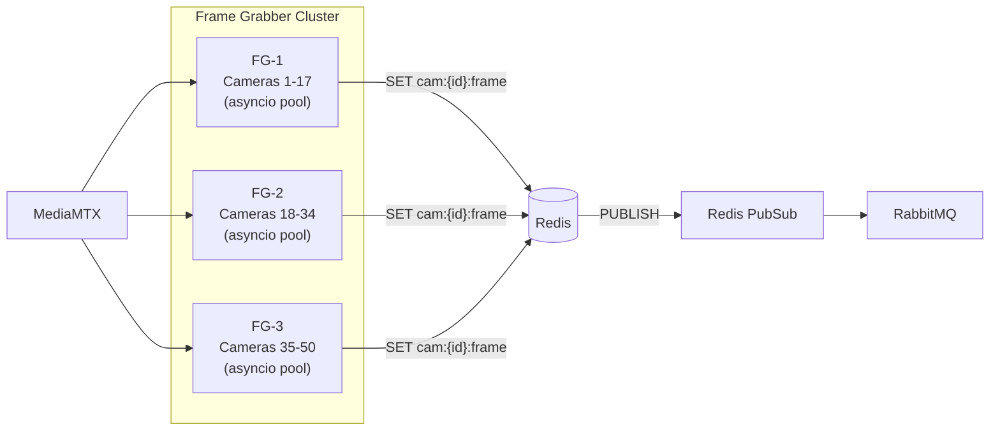

**Implementação assíncrona com Python asyncio:**

```python
async def grab_frames_async(camera_list: List[Camera]):
    tasks = [grab_single_camera(cam) for cam in camera_list]
    await asyncio.gather(*tasks, return_exceptions=True)

async def grab_single_camera(camera: Camera):
    while True:
        frame = await loop.run_in_executor(executor, cv2.VideoCapture.read)
        compressed = cv2.imencode(".jpg", frame, [cv2.IMWRITE_JPEG_QUALITY, 85])[1]
        await redis.set(f"cam:{camera.id}:frame", compressed.tobytes(), ex=10)
        await redis.publish(f"cam:{camera.id}:new_frame", camera.id)
```

**Sharding por Hash de Camera ID:**

```python
def get_grabber_instance(camera_id: str) -> int:
    shard = hash(camera_id) % NUM_GRABBER_INSTANCES
    return shard  # 0, 1 ou 2
```

### 4.3 Redis Frame Cache

| Configuração | Valor | Justificativa |
|-------------|-------|---------------|
| TTL dos frames | 10 segundos | Balanceia memória vs freshness |
| Compressão | JPEG quality 85 | Reduz uso de memória 10x |
| Estrutura de chave | `cam:{id}:frame` | Lookup O(1) por câmera |
| Pub/Sub | `cam:{id}:new_frame` | Notifica workers sem polling |
| Memória estimada (500 câmeras) | ~2.5 GB | Frame 1080p JPEG ~5KB x 500 |
| Modo de deployment | Redis Cluster (3 nós) | Alta disponibilidade |

### 4.4 RabbitMQ — Message Broker

**Topologia de Filas:**

| Fila | Producer | Consumer | Prefetch |
|------|----------|----------|----------|
| `ai.frame.lpr` | Frame Grabbers | LPR Workers | 8 |
| `ai.frame.general` | Frame Grabbers | Analytics Workers | 16 |
| `ai.frame.face` | Frame Grabbers | Face Workers | 8 |
| `ai.events` | AI Workers | Event Consumer | 100 |
| `ai.events.dlq` | Sistema (falhas) | DLQ Handler | 10 |

### 4.5 AI Worker Clusters

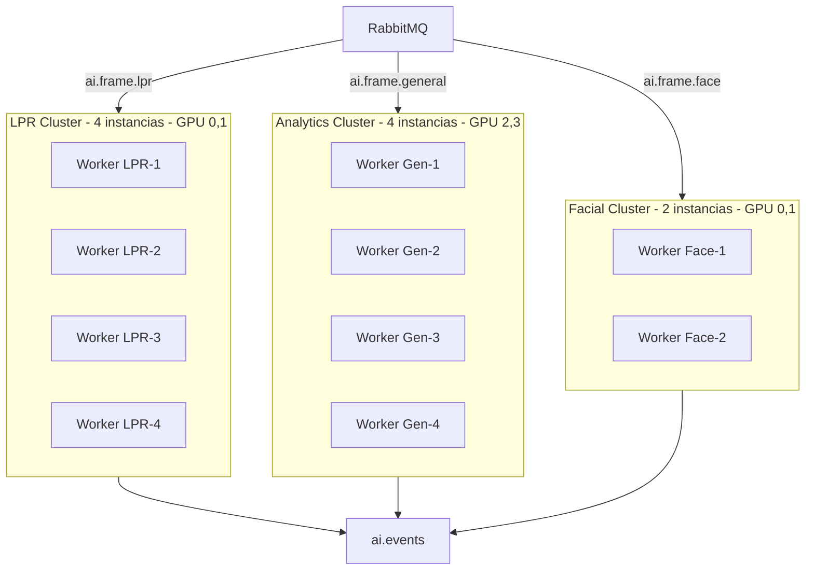

**Configuração dos Workers LPR:**

```python
MAX_CONCURRENT_FRAMES = 8   # vs 4 atual
OCR_WORKERS = 8              # Thread pool para OCR paralelo
GPU_DEVICE = "cuda:0"        # Alocacao GPU dedicada
BATCH_SIZE = 4              # Inference em batch
MODEL = "yolov8n-lpr.pt"   # YOLO otimizado para placas
OCR_ENGINE = "paddleocr"   # Substitui Tesseract
```

**Análise de Capacidade — LPR Workers:**

| Métrica | Anterior | Proposto | Melhoria |
|---------|----------|----------|----------|
| Instâncias | 1 | 4 | 4x |
| Concurrent frames/instância | 4 | 8 | 2x |
| OCR engine | Tesseract (80ms) | PaddleOCR (15ms) | 5.3x mais rápido |
| Throughput total | ~7.5 FPS | ~80 FPS | 10.6x |
| Demanda | 50 FPS | 50 FPS | Margem: 60% |

---

## 5. Pipelines de Processamento

### 5.1 Pipeline Principal

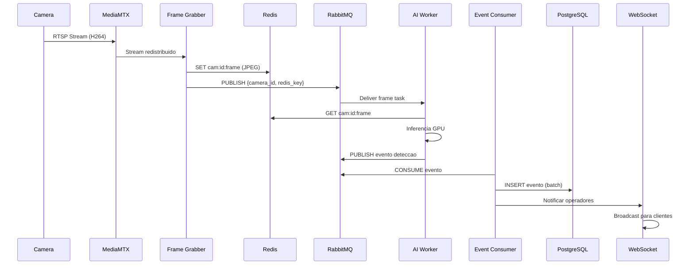

### 5.2 Pipeline LPR Detalhado

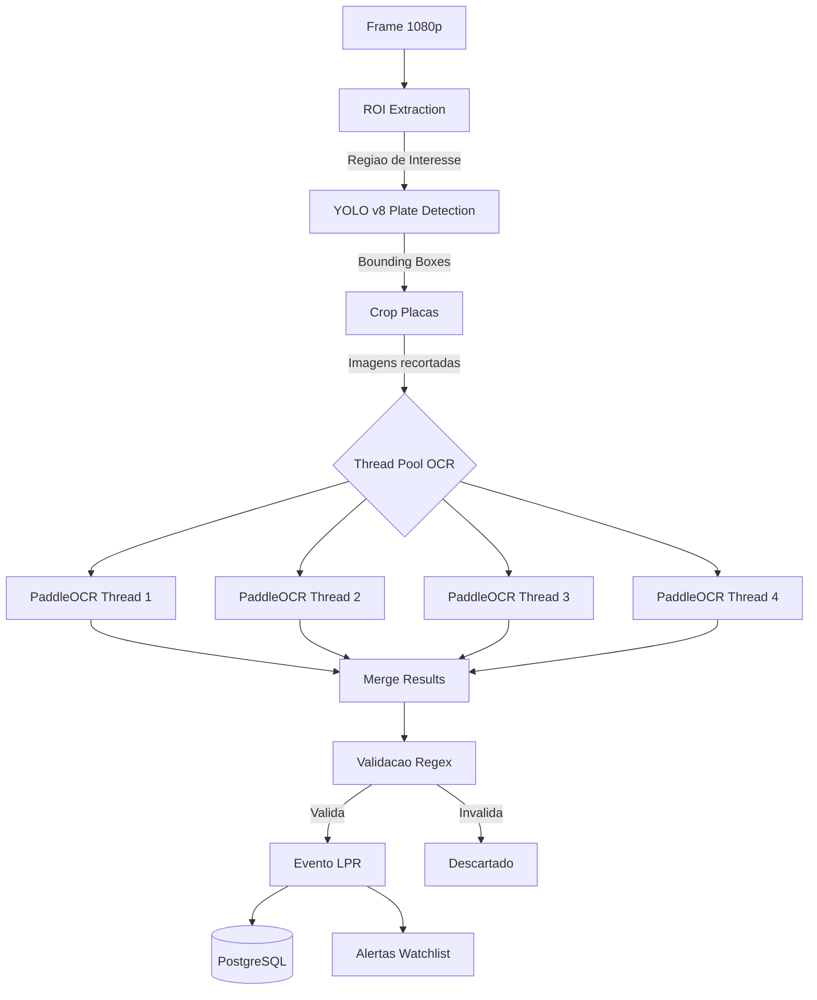

**Latências por Etapa — Pipeline LPR:**

| Etapa | Latência | Componente |
|-------|----------|------------|
| Captura e compressão JPEG | 40ms | Frame Grabber (async) |
| Publicação Redis | 2ms | Redis SET + PUBLISH |
| Queue delay (RabbitMQ) | 5ms | Fila vazia baseline |
| YOLO plate detection | 15ms | GPU inference (batch) |
| Crop + pre-processamento | 5ms | CPU (NumPy) |
| PaddleOCR (6 placas paralelo) | 45ms | Thread pool (15ms x1) |
| Validacao + enrichment | 5ms | CPU (regex + lookup) |
| Event publish + DB insert | 55ms | Event Consumer (batch) |
| **TOTAL ESTIMADO** | **~172ms** | **vs objetivo < 2000ms** |

### 5.3 Pipeline de Analytics Gerais

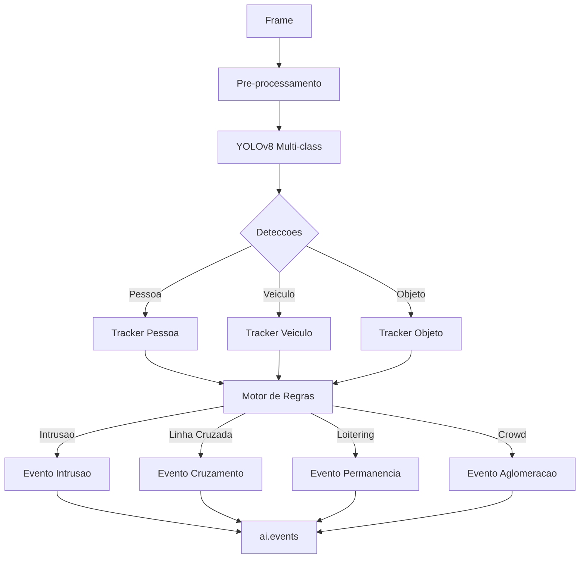

**Analíticos Suportados:**

| Analítico | Categoria | Latência | Modelo |
|-----------|-----------|----------|--------|
| Detecção de Pessoas | Básico | 20ms | YOLOv8n |
| Detecção de Veículos | Básico | 20ms | YOLOv8n |
| Detecção de Intrusão | Zona | 25ms | YOLOv8n + Rules |
| Linha Cruzada | Zona | 25ms | YOLOv8n + Tracker |
| Loitering (Permanência) | Comportamental | 30ms | YOLOv8n + Timer |
| Objetos Abandonados | Comportamental | 35ms | Background Subtraction |
| Crowd Counting | Estatístico | 30ms | YOLOv8n + Counter |
| Heatmap de Movimento | Estatístico | 40ms | Optical Flow |
| LPR | Avançado | 172ms | YOLOv8 + PaddleOCR |
| Reconhecimento Facial | Avançado | 150ms | RetinaFace + ArcFace |

---

## 6. Planejamento de Infraestrutura

### 6.1 Diagrama de Infraestrutura

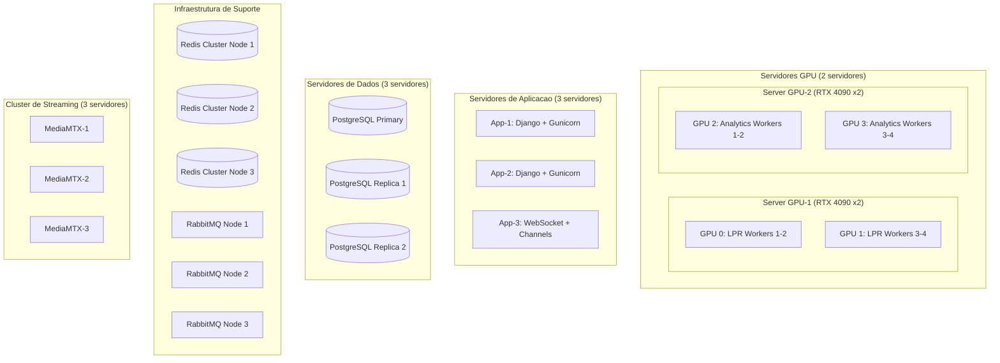

### 6.2 Dimensionamento de Hardware

| Componente | CPU | RAM | GPU | Storage | Qtd |
|------------|-----|-----|-----|---------|-----|
| Servidor GPU (LPR) | 16 cores | 64 GB | 2x RTX 4090 | NVMe 1TB | 1 |
| Servidor GPU (Analytics) | 16 cores | 64 GB | 2x RTX 4090 | NVMe 1TB | 1 |
| App Server | 8 cores | 32 GB | - | SSD 500GB | 3 |
| DB Server | 8 cores | 64 GB | - | NVMe 2TB | 3 |
| Redis Node | 4 cores | 32 GB | - | SSD 200GB | 3 |
| RabbitMQ Node | 4 cores | 16 GB | - | SSD 200GB | 3 |
| MediaMTX Node | 8 cores | 16 GB | - | SSD 200GB | 3 |
| Frame Grabber | 8 cores | 16 GB | - | SSD 200GB | 3 |
| Monitoring (Prometheus+Grafana) | 4 cores | 16 GB | - | SSD 500GB | 1 |

### 6.3 Estimativa de Rede

| Segmento | Bandwidth Estimado | Justificativa |
|----------|-------------------|---------------|
| Câmeras → MediaMTX (ingress) | ~12.5 Gbps | 500 câmeras x 25Mbps médio |
| MediaMTX → Frame Grabbers | ~2.5 Gbps | Apenas fluxo para IA (1 cliente) |
| Frame Grabbers → Redis | ~500 Mbps | 500 câmeras x 1MB/s (5 FPS JPEG) |
| Redis → Workers (GET) | ~300 Mbps | Workers consumindo frames |
| Workers → Event Bus | < 50 Mbps | Apenas metadata JSON |
| DB replication | ~1 Gbps | PostgreSQL streaming replication |

### 6.4 Armazenamento de Vídeo

| Parâmetro | Valor | Cálculo |
|-----------|-------|---------|
| Câmeras totais | 500 | - |
| Resolução média | 1080p H.264 | Bitrate médio: 2 Mbps |
| Retenção de vídeo | 30 dias | Requisito operacional |
| Storage total estimado | ~324 TB | 500 x 2Mbps x 86400s x 30 / 8 |
| Storage + overhead (20%) | ~390 TB | Índices, thumbnails, exports |
| Recomendação | NAS 400TB RAID-6 | Com expansão para 600TB |

---

## 7. Monitoramento e Observabilidade

### 7.1 Stack de Monitoramento

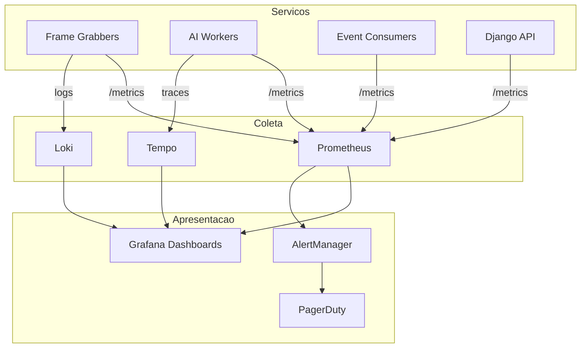

### 7.2 Métricas Prometheus Principais

| Métrica | Tipo | Descrição | Alerta se |
|---------|------|-----------|-----------|
| `lpr_frames_processed_total` | Counter | Total de frames LPR processados | - |
| `lpr_processing_latency_seconds` | Histogram | Latência end-to-end LPR | p99 > 2s |
| `lpr_queue_depth` | Gauge | Profundidade da fila LPR | > 1000 |
| `ocr_success_rate` | Gauge | Taxa de sucesso OCR | < 80% |
| `frame_grabber_fps` | Gauge | FPS atual por câmera | < 1 FPS |
| `ai_worker_gpu_utilization` | Gauge | Uso de GPU por worker | > 95% |
| `event_consumer_lag` | Gauge | Lag do consumer de eventos | > 500 eventos |
| `camera_stream_health` | Gauge | Saúde dos streams (0/1) | < 1 (offline) |

### 7.3 SLOs e SLAs

| SLO | Target | Medição | Janela |
|-----|--------|---------|--------|
| Disponibilidade do sistema | 99.9% | uptime / total_time | Mensal |
| Latência LPR p95 | < 500ms | lpr_latency histogram p95 | Semanal |
| Latência LPR p99 | < 2s | lpr_latency histogram p99 | Semanal |
| Taxa de sucesso OCR | > 85% | ocr_success_rate média | Diário |
| Câmeras online | > 98% | camera_stream_health média | Diário |
| Tempo de detecção eventos | < 2s | event_detection_latency | Semanal |

---

## 8. Planejamento de Sprints

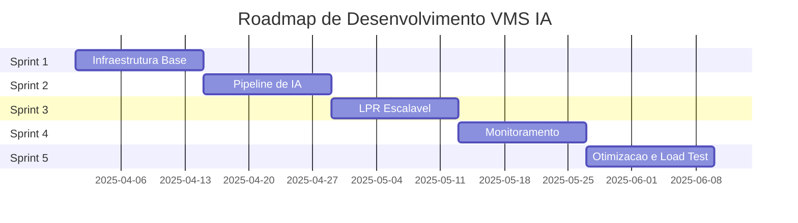

### Sprint 1 — Infraestrutura Base (Semanas 1-2)

**Objetivo:** Estabelecer toda a infraestrutura de suporte antes de qualquer desenvolvimento de aplicação.

| Tarefa | Responsável | Estimativa | Prioridade |
|--------|-------------|------------|------------|
| Provisionar servidores GPU | DevOps | 2 dias | P0 |
| Instalar e configurar Docker Swarm / K8s | DevOps | 3 dias | P0 |
| Deploy Redis Cluster (3 nós) | DevOps | 1 dia | P0 |
| Deploy RabbitMQ Cluster (3 nós) | DevOps | 1 dia | P0 |
| Configurar MediaMTX Cluster | DevOps | 2 dias | P0 |
| Deploy PostgreSQL com replicação | DBA | 2 dias | P1 |
| Setup Prometheus + Grafana base | DevOps | 1 dia | P1 |
| Configurar CI/CD pipeline | DevOps | 2 dias | P1 |
| Network: VLANs e firewall rules | NetOps | 2 dias | P0 |

**Entregáveis:** Cluster operacional, serviços HA, CI/CD funcional, monitoramento básico.

**Riscos:** Disponibilidade de hardware GPU (lead time), complexidade K8s em ambiente seguro.

### Sprint 2 — Pipeline de IA Base (Semanas 3-4)

**Objetivo:** Implementar o pipeline assíncrono de frames e workers de analytics gerais.

| Tarefa | Responsável | Estimativa | Prioridade |
|--------|-------------|------------|------------|
| Refatorar Frame Grabber para asyncio | Backend Dev | 3 dias | P0 |
| Implementar sharding de câmeras | Backend Dev | 2 dias | P0 |
| Integrar Redis Frame Cache | Backend Dev | 2 dias | P0 |
| Implementar AI Worker base (asyncio) | ML Dev | 3 dias | P0 |
| Containerizar workers com GPU support | DevOps | 2 dias | P0 |
| Implementar consumer de eventos async | Backend Dev | 2 dias | P1 |
| Testes de integração do pipeline | QA | 2 dias | P1 |
| Métricas Prometheus para todos os componentes | Backend Dev | 1 dia | P1 |

**Entregáveis:** Frame Grabber async, Redis Frame Cache, AI Workers básicos, pipeline end-to-end funcional.

### Sprint 3 — LPR Escalável (Semanas 5-6)

**Objetivo:** Implementar e validar o pipeline LPR com PaddleOCR paralelo, substituindo Tesseract.

| Tarefa | Responsável | Estimativa | Prioridade |
|--------|-------------|------------|------------|
| Substituir Tesseract por PaddleOCR | ML Dev | 3 dias | P0 |
| Implementar thread pool OCR (8 threads) | ML Dev | 2 dias | P0 |
| Otimizar YOLO para detecção de placas | ML Dev | 3 dias | P0 |
| Implementar ROI extraction configurável | ML Dev | 2 dias | P1 |
| Configurar 4 instâncias LPR Worker | DevOps | 1 dia | P0 |
| Implementar validação de placas (regex) | Backend Dev | 1 dia | P1 |
| Integrar watchlist de placas | Backend Dev | 2 dias | P1 |
| Load test: 50 cameras LPR simultâneas | QA | 2 dias | P0 |

**Entregáveis:** Pipeline LPR com PaddleOCR, 50 câmeras validadas, latência < 500ms p95, watchlist funcional.

### Sprint 4 — Monitoramento Avançado (Semanas 7-8)

**Objetivo:** Observabilidade completa, alertas e dashboards operacionais.

| Tarefa | Responsável | Estimativa | Prioridade |
|--------|-------------|------------|------------|
| Dashboards Grafana: Pipeline Overview | DevOps | 2 dias | P0 |
| Dashboard: LPR Performance | DevOps | 2 dias | P0 |
| Dashboard: GPU Utilization | DevOps | 1 dia | P0 |
| Configurar AlertManager + PagerDuty | DevOps | 2 dias | P0 |
| Implementar health checks em todos os serviços | Backend Dev | 2 dias | P1 |
| Distributed tracing com Tempo | Backend Dev | 3 dias | P1 |
| SLO monitoring e relatórios | DevOps | 2 dias | P1 |

### Sprint 5 — Otimização e Load Test (Semanas 9-10)

**Objetivo:** Validar performance em escala real (500 câmeras), corrigir gargalos e preparar para produção.

| Tarefa | Responsável | Estimativa | Prioridade |
|--------|-------------|------------|------------|
| Load test: 500 câmeras simultâneas | QA + DevOps | 3 dias | P0 |
| Profiling e otimização de bottlenecks | Backend Dev | 3 dias | P0 |
| Fine-tuning de parâmetros Redis/RabbitMQ | DevOps | 2 dias | P1 |
| Teste de failover e recovery | DevOps | 2 dias | P0 |
| Documentação de operação | Tech Writer | 2 dias | P1 |
| Runbooks de incidentes | DevOps | 2 dias | P1 |
| Go-live checklist e sign-off | Tech Lead | 1 dia | P0 |

---

## 9. Análise de Riscos

### 9.1 Matriz de Riscos

| Risco | Probabilidade | Impacto | Score | Mitigação |
|-------|--------------|---------|-------|-----------|
| Lead time de GPU > 90 dias | Alta | Alto | 9/10 | Usar cloud GPU temporariamente |
| Performance OCR insuficiente | Média | Alto | 6/10 | Benchmark PaddleOCR antes do sprint 3 |
| Câmeras com streams instáveis | Alta | Médio | 6/10 | Circuit breaker no Frame Grabber |
| Memória Redis insuficiente | Baixa | Alto | 4/10 | Monitorar uso e escalar horizontalmente |
| Latência de rede interna alta | Baixa | Alto | 4/10 | Topologia de rede dedicada para câmeras |
| Falha de nó do cluster | Média | Médio | 4/10 | HA em todos os componentes críticos |
| Throughput RabbitMQ no limite | Baixa | Alto | 4/10 | Migrar para Kafka se > 2000 câmeras |
| Drift de modelo de IA | Média | Médio | 4/10 | Retreinamento periódico + monitoramento |

### 9.2 Erros Arquiteturais a Evitar

**Erro 1: IA Acoplada ao Stream**
```python
# ERRADO: IA conecta diretamente na camera
cap = cv2.VideoCapture("rtsp://camera:554/stream")

# CORRETO: IA consome frames do Redis
frame_data = await redis.get(f"cam:{camera_id}:frame")
```

**Erro 2: Armazenar Frames em Disco** — Redis é 100-1000x mais rápido, TTL 10s é suficiente.

**Erro 3: Worker Monolítico de Analytics** — Cada analítico deve ter seu próprio cluster de workers.

**Erro 4: Sem Controle de Backpressure** — Prefetch no RabbitMQ + batch inserts no PostgreSQL.

---

## 10. Guia de Deployment

### 10.1 Ordem de Deploy

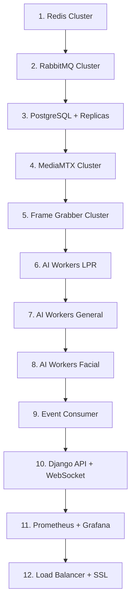

### 10.2 Checklist de Go-Live

| Categoria | Item | Verificado |
|-----------|------|------------|
| Infraestrutura | Todos os servidores com hardware correto | [ ] |
| Infraestrutura | Rede configurada com VLANs corretas | [ ] |
| Infraestrutura | Redundância N+1 em todos os componentes críticos | [ ] |
| Performance | Load test 500 câmeras aprovado | [ ] |
| Performance | Latência LPR p99 < 2s validada | [ ] |
| Performance | Taxa OCR > 85% em condições reais | [ ] |
| Monitoramento | Todos os alertas Prometheus configurados | [ ] |
| Monitoramento | Dashboards Grafana revisados e aprovados | [ ] |
| Segurança | TLS em todos os endpoints | [ ] |
| Segurança | Credenciais em secrets manager (não em código) | [ ] |
| DR | Runbooks de incidentes documentados | [ ] |
| DR | Teste de failover realizado com sucesso | [ ] |
| Backup | Backup automatizado do PostgreSQL configurado | [ ] |

### 10.3 Escalabilidade Futura (> 2000 câmeras)

| Componente Atual | Limite Estimado | Substituto |
|-----------------|-----------------|------------|
| RabbitMQ | ~1000-2000 câmeras | Apache Kafka |
| Redis single-cluster | ~2000 câmeras | Redis Enterprise |
| PostgreSQL single-primary | ~5000 eventos/s | TimescaleDB ou Cassandra |
| Container manual | Escalonamento lento | Kubernetes HPA + GPU device plugin |
| Métricas Prometheus | ~100 serviços | Prometheus Thanos |

---

## 11. Especificação de Microserviços

### 11.1 Mapa de Microserviços

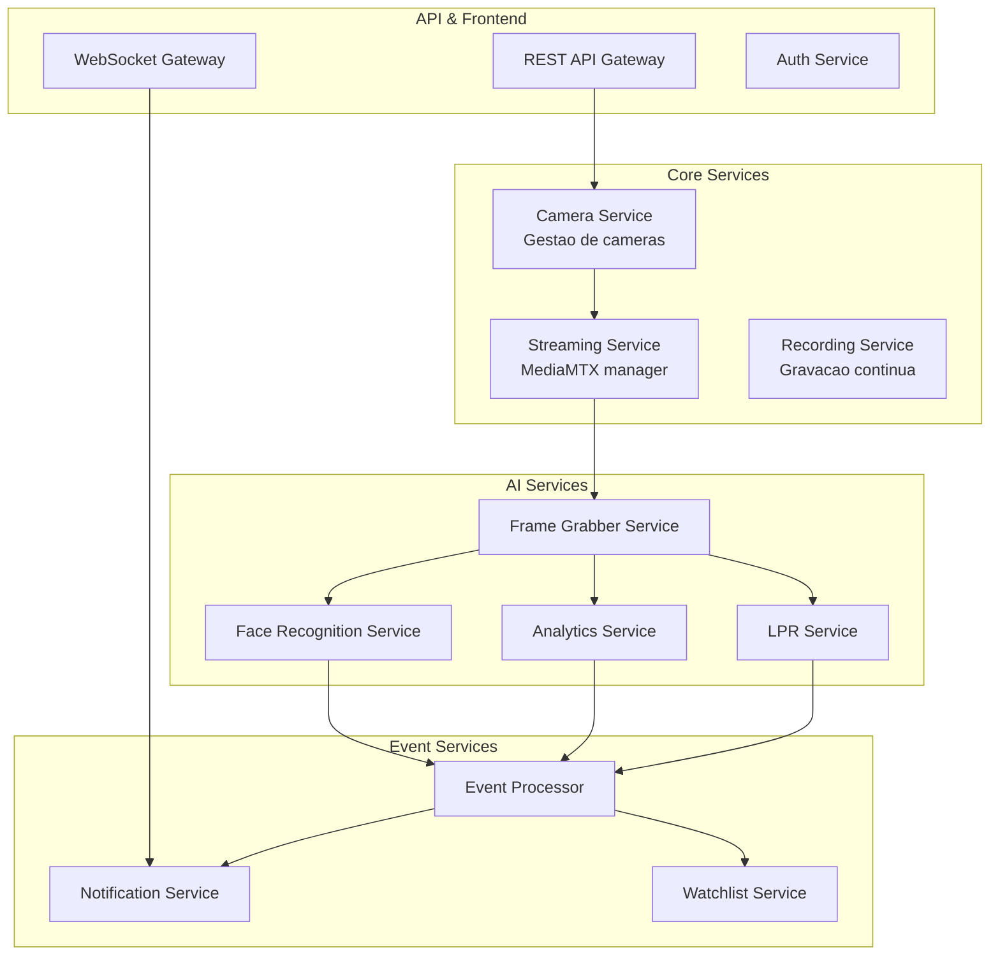

### 11.2 APIs dos Serviços Principais

**LPR Service API:**

| Endpoint | Método | Descrição | Response |
|----------|--------|-----------|----------|
| `/lpr/events` | GET | Listar eventos LPR com filtros | 200 + JSON Array |
| `/lpr/events/{id}` | GET | Evento LPR por ID | 200 + JSON Object |
| `/lpr/watchlist` | GET/POST | Gerenciar watchlist de placas | 200/201 + JSON |
| `/lpr/cameras/{id}/config` | PUT | Configurar ROI por câmera | 200 + JSON |
| `/lpr/metrics` | GET | Métricas de performance LPR | 200 + JSON |

**Camera Service API:**

| Endpoint | Método | Descrição | Response |
|----------|--------|-----------|----------|
| `/cameras` | GET/POST | Listar / Criar câmeras | 200/201 + JSON |
| `/cameras/{id}` | GET/PUT/DELETE | CRUD por câmera | 200/204 + JSON |
| `/cameras/{id}/stream` | GET | URL de stream HLS/RTSP | 200 + JSON |
| `/cameras/{id}/health` | GET | Status de conectividade | 200 + JSON |
| `/cameras/{id}/analytics` | GET/PUT | Configurar analíticos por câmera | 200 + JSON |

---

## 12. Resumo de Performance Esperada

### 12.1 Comparativo Antes vs Depois

| Métrica | Arquitetura Atual | Arquitetura Proposta | Melhoria |
|---------|-------------------|----------------------|----------|
| FPS Frame Grabber (50 cameras) | 0.36 FPS (sequencial) | 50+ FPS (paralelo async) | >138x |
| Throughput AI Workers | ~7.5 FPS (total) | 80 FPS (LPR cluster) | >10x |
| Latência OCR por placa | 80ms (Tesseract) | 15ms (PaddleOCR) | 5.3x mais rápido |
| Latência 6 placas simultâneas | 480ms | 45ms (paralelo) | 10.6x mais rápido |
| Latência end-to-end LPR | >2500ms | ~172ms | 14.5x mais rápido |
| I/O de disco por frame | 15-30ms | 0ms (Redis) | Eliminado |
| Event throughput | 66 eventos/s | 300+ eventos/s | 4.5x |
| Câmeras suportadas | ~10-20 | 500 | 25-50x |

### 12.2 Latência Detalhada — Pipeline LPR

```mermaid
gantt
    title Latencia Pipeline LPR (ms)
    dateFormat X
    axisFormat %Lms
    section Frame Grabber
    Captura e compressao JPEG : 0, 40
    section Redis
    SET + PUBLISH             : 40, 42
    section RabbitMQ
    Queue delay               : 42, 47
    section Worker
    YOLO plate detection      : 47, 62
    Crop + pre-processamento  : 62, 67
    PaddleOCR (paralelo)      : 67, 112
    Validacao + enrichment    : 112, 117
    section Event Consumer
    Batch insert + WebSocket  : 117, 172
```

### 12.3 Recomendações Finais

1. Implementar o Frame Grabber assíncrono como primeira prioridade — é o maior gargalo atual.
2. Migrar para Redis Frame Cache antes de qualquer outro trabalho de escalabilidade.
3. Substituir Tesseract por PaddleOCR para ganhos imediatos de 5x na latência OCR.
4. Configurar 4 instâncias do LPR Worker com MAX_CONCURRENT_FRAMES=8 cada.
5. Implementar monitoramento desde o Sprint 1, não como atividade final.
6. Planejar migração para Kafka quando o sistema ultrapassar 1500 câmeras.
7. Manter margem de 60% de capacidade para absorver picos sem degradação.

---

*VMS com Inteligência Artificial — Documentação Técnica Completa v2.0 — Confidencial — Uso Interno*
