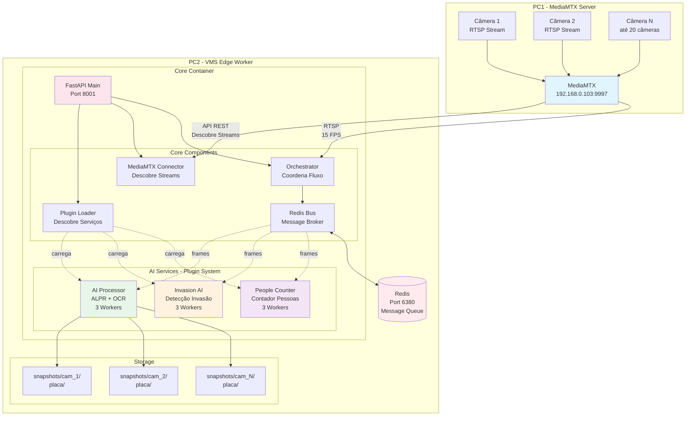
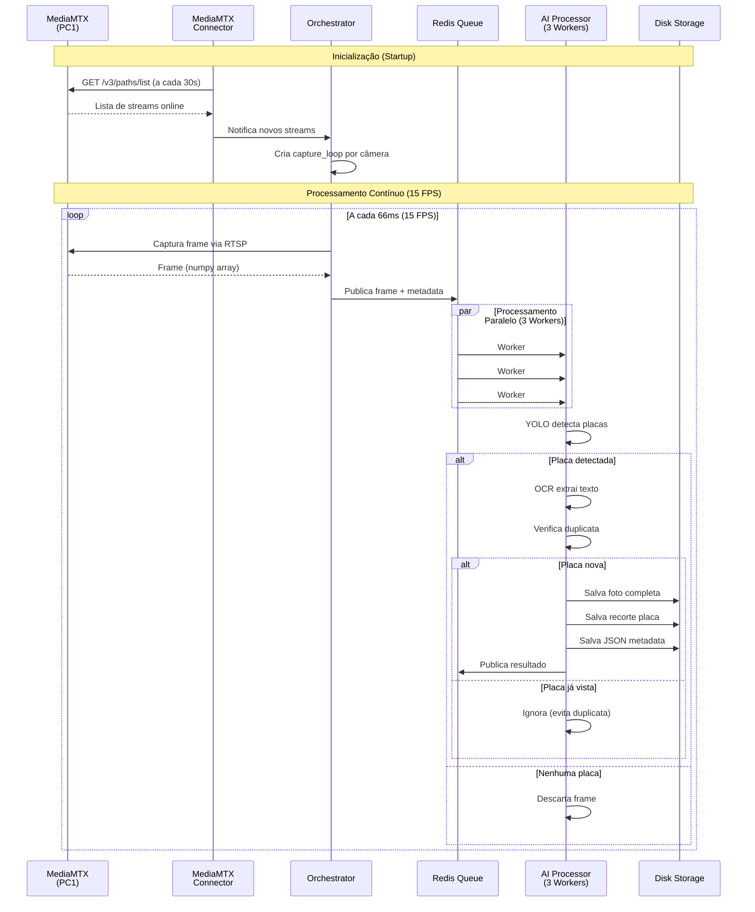
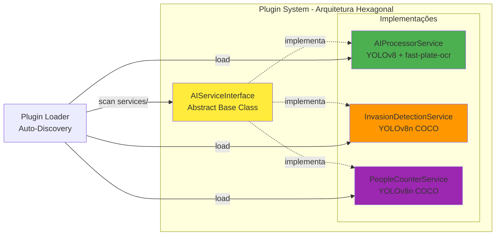
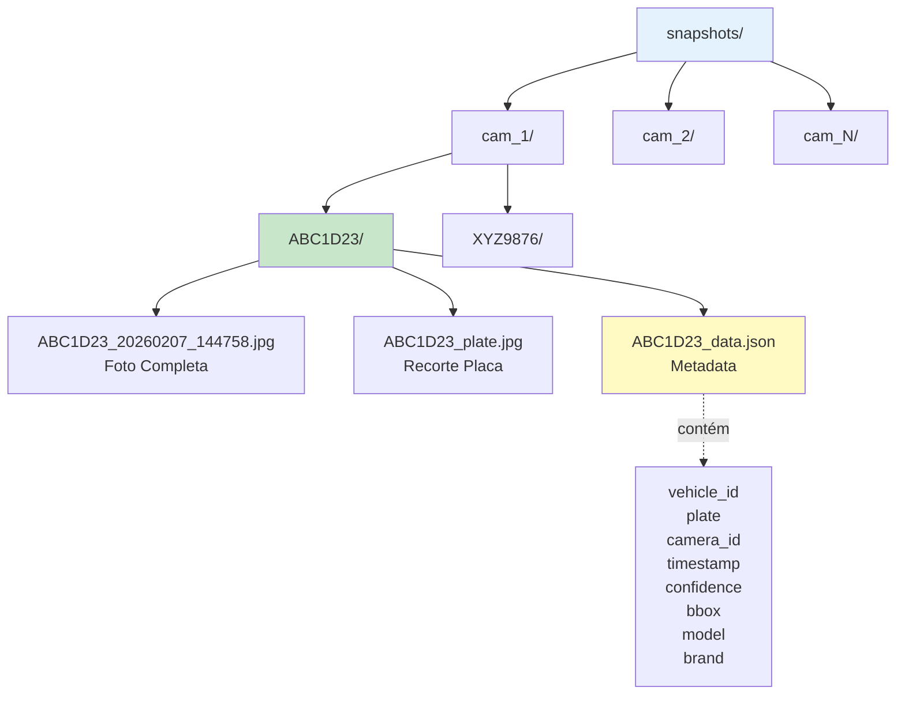
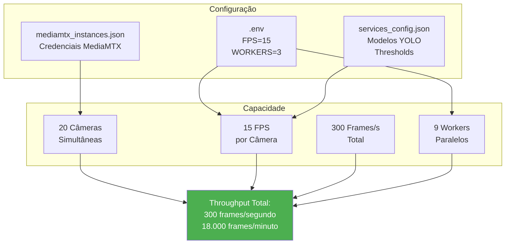
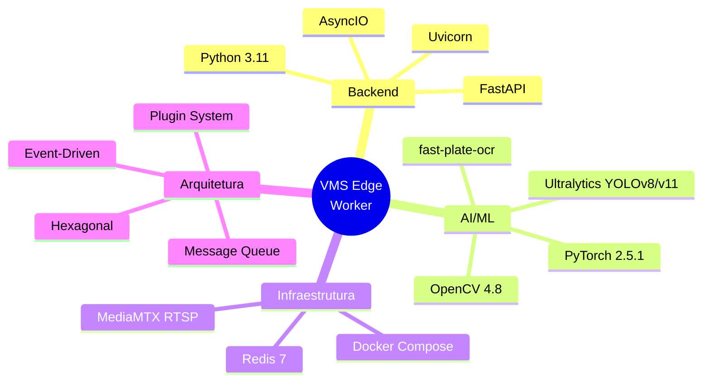

# Arquitetura VMS Edge Worker - Diagrama Mermaid

## Visão Geral do Sistema

## Fluxo de Dados Detalhado

## Estrutura de Plugins

## Estrutura de Dados - Snapshots

## Configuração e Escalabilidade

## Tecnologias Utilizadas

## Características Principais

- ✅ **Plugin-Based**: Adicione serviços em `/services` - descoberta automática
- ✅ **Multi-Tenant**: Suporta N instâncias MediaMTX com credenciais diferentes
- ✅ **Isolamento**: Cada serviço tem suas próprias dependências
- ✅ **Escalável**: 20 câmeras × 15 FPS = 300 frames/segundo
- ✅ **Resiliente**: Auto-discovery de streams a cada 30s
- ✅ **Portável**: Copie uma pasta de serviço para outro projeto
- ✅ **Zero Duplicatas**: Rastreamento por câmera evita reprocessamento
